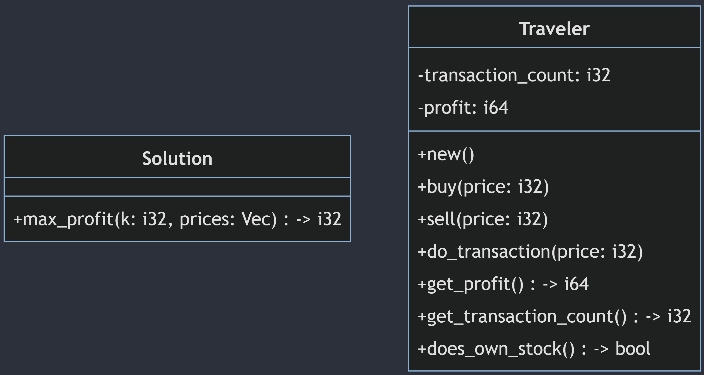

# 🚀Unique Solution🚀
* Breadth First Search (BFS as opposed to DFS or DP) 
* Simulation with eliminations
# Just Like Real Stock Traders (🚀🚀🚀🚀🚀)
# O(k^3)
🦀 My solution simulates 💻 traders ("Traveler"s) buying and selling stocks 📈.
\
🦀 Each day each trader has two options: trade or not trade (🤑).
\
🦀 That binary decision causes the number of simulated traders to double each passing day.
\
🦀 An elimination technique is used to reduce the number of traders each day to a maximum of k+1 📉
\
🦀 The elimination technique is a O(n^2) algorithm where n is the number of traders.
# Blazingly fast 🚀🚀 (🚀🚀🚀)
Here is the UML diagram and explanation formatted as Markdown to add to your GitHub README:

# Components and Functions UML

The key components are:

- Solution - Contains the main max_profit function
- Traveler - Represents a trader simulation, contains state and actions

The main flow is:

- max_profit() calls fork_decisions() and reduce_contestants() iteratively on a list of Travelers to simulate different buy/sell decisions
- fork_decisions() clones and modifies Travelers to create new simulation states  
- reduce_contestants() eliminates duplicate Traveler states
- Helper functions like is_left_worse_than_right_on_every_metric() are used by reduce_contestants() to compare Travelers
